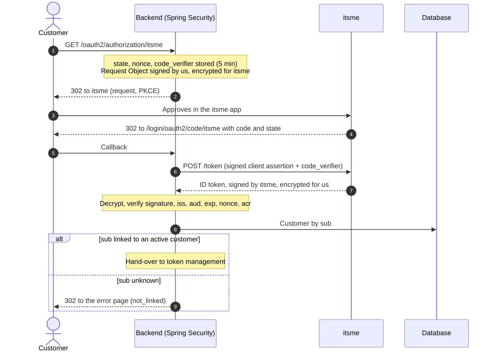

# itsme login with Spring Security — reference sample

A runnable reference implementation of a customer login with **itsme** (OpenID Connect, itsme API **v2**) in a **stateless Spring Boot 4 backend**, for a fictitious energy supplier, *VoltaHome*.

- **Both itsme client authentication methods**, with one switch (`itsme.client-authentication`):
  - **key pairs** (`private-key-jwt`, the default, recommended by itsme): the authorization request travels in a Request Object signed by us and encrypted for itsme; ID tokens are signed by itsme and encrypted with our public key;
  - **client secret** (`client-secret`): a shared secret, parameters in the URL, ID tokens encrypted with a key derived from the secret.
- **Authentication, not identification**: no personal data is requested from itsme. The customer is found through the itsme `sub` (a pseudonym) already linked to their account; an itsme account that is not linked is refused. See [Authentication, not identification](#authentication-not-identification).
- **Runs with IntelliJ and a JDK only**: no Docker, no database server, no itsme credentials. In the tests, itsme is replaced by **WireMock**; when the application runs locally, it serves an **itsme stub** itself (`local` profile). The database is **H2 in memory**.

> **Scope of the stubs.** WireMock and the itsme stub reproduce our reading of the public itsme v2 documentation. They prove that the code is consistent with that reading, not with itsme's real behaviour. Points marked *to be confirmed in E2E* must be verified against the itsme E2E environment.

---

## Start here

New to the project? Follow this order; it takes about an hour.

1. **Run it.** Run the tests, then the browser demo: [Quick start in IntelliJ](#quick-start-in-intellij) and [Run the login in a browser](#run-the-login-in-a-browser).
2. **See the whole login.** Read the diagram in [Login flow](#login-flow).
3. **Learn the rules.** Read [Rules you must not change](#rules-you-must-not-change) before you change any code.
4. **Read five files, in this order:**

| File | What it shows |
|---|---|
| `security/SecurityConfig.java` | Where each itsme part is plugged into Spring Security |
| `itsme/ItsmeAuthorizationRequestResolver.java` | What we send to itsme (with key pairs, through `ItsmeRequestObjectFactory`) |
| `itsme/ItsmeClientConfig.java` | How the ID token is decrypted and checked (`idTokenDecoderFactory`) |
| `itsme/ItsmeOidcUserService.java` | How the itsme `sub` becomes our customer |
| `itsme/JdbcAuthorizationRequestRepository.java` | How a login in progress survives without a session |

5. **Read the tests as a list of attacks.** Start with `ItsmeLoginFlowTest`: each test changes one thing in a valid login and states the expected answer.

### Glossary

| Term | Meaning in this sample |
|---|---|
| `sub` | The user id itsme gives us: a stable pseudonym, specific to our client. It says "same itsme account as last time", not who the person is. |
| `acr` | The authentication level. We require `acr_advanced` (itsme code); `acr_basic` also allows a fingerprint. |
| `state` | A random value that ties the callback to the login we started. Protects against a forged callback. |
| `nonce` | A random value copied into the ID token. Protects against a replayed ID token. |
| PKCE | `code_verifier` (kept by us) and `code_challenge` (its SHA-256, sent to itsme). Only the holder of the verifier can exchange the authorization code. |
| Authorization code | A short-lived (3 minutes), opaque value that itsme sends back through the browser; the backend exchanges it for the ID token. |
| ID token | A JWT from itsme saying who logged in (`sub`), at which level (`acr`), for which client and login (`aud`, `nonce`). |
| JWS / JWE | A signed JWT (proves who wrote it) / an encrypted JWT (hides the content). |
| Nested JWT | A JWS inside a JWE: signed, then encrypted. itsme ID tokens must be nested. |
| Request Object | With key pairs, the authorization parameters packed in a JWT, signed by us and encrypted for itsme. |
| Client assertion | With key pairs, a short JWT signed by us that proves our identity at the token endpoint (`private_key_jwt`). |
| JWKS | A JSON set of public keys. itsme publishes its own; we publish ours at `/.well-known/jwks.json`. |
| Discovery document | itsme's published configuration (`.well-known/openid-configuration`). Here it is only compared with our configuration, never used as a source. |
| Service code | The itsme service our client uses, sent as the `service:<code>` scope. |
| Hand-over | The end of the itsme login: `ItsmeLoginResult` is passed to `LoginHandover`, where the application issues its own session or token. |

---

## Contents

- [Start here](#start-here)
- [Quick start in IntelliJ](#quick-start-in-intellij)
- [Run the login in a browser](#run-the-login-in-a-browser)
- [What the sample demonstrates](#what-the-sample-demonstrates)
- [Authentication, not identification](#authentication-not-identification)
- [Two client authentication methods](#two-client-authentication-methods)
- [Project structure](#project-structure)
- [Login flow](#login-flow)
- [Keys](#keys)
- [Configuration](#configuration)
- [Authorization request](#authorization-request)
- [Token request](#token-request)
- [ID token validation](#id-token-validation)
- [Customer mapping](#customer-mapping)
- [Login in progress](#login-in-progress)
- [Stateless security configuration](#stateless-security-configuration)
- [Hand-over](#hand-over)
- [Error codes](#error-codes)
- [Rules you must not change](#rules-you-must-not-change)
- [Using the code in a real application](#using-the-code-in-a-real-application)
- [Points to confirm in itsme E2E](#points-to-confirm-in-itsme-e2e)
- [Test data](#test-data)

---

## Quick start in IntelliJ

Requirements: IntelliJ IDEA (Community edition is enough) and JDK 17 or later. Maven is bundled with IntelliJ.

Stack: Spring Boot 4.0.7 (Spring Framework 7, Spring Security 7, Jackson 3), Nimbus JOSE + JWT (managed by Spring Boot), H2, WireMock 3.

1. **Open the project**: *File → Open…*, select `pom.xml`, choose *Open as Project*. IntelliJ downloads the dependencies.
2. **Check the JDK**: *File → Project Structure → Project → SDK* = 17 or later.
3. **Run the tests**: select the run configuration **All tests** (top-right of the window) and click *Run*, or right-click `src/test/java` → *Run 'All Tests'*.

`ItsmeLoginFlowTest` covers the protocol with key pairs (keys, Request Object, client assertion, ID token, state). `ClientSecretLoginFlowTest` covers what differs with a client secret. From a terminal, `mvn verify` does the same.

---

## Run the login in a browser

1. Select the run configuration **VoltaHome (local, itsme stub)** and click *Run*. It starts `VoltaHomeApplication` with `-Dspring.profiles.active=local` and the key pairs method. **VoltaHome (local, itsme stub, client secret)** starts the client secret method instead (`-Ditsme.client-authentication=client-secret`).
   Without the shared run configuration: *Run → Edit Configurations → + → Application*, main class `com.example.voltahome.VoltaHomeApplication`, VM options `-Dspring.profiles.active=local`.
2. Open <http://localhost:8080> and click **Log in with itsme**.
3. The **itsme stub** page shows what the application asked for, read from the decrypted Request Object, and offers test itsme accounts:

| itsme account | Expected result |
|---|---|
| Alex Martin — itsme linked | Login result as JSON (customer `C-1001`) |
| Sam Peeters — customer, itsme not linked | Error page: itsme account not linked |
| Someone who is not a customer | Error page: itsme account not linked (same answer as Sam: the application cannot tell them apart) |
| Robin Dubois — contract closed | Error page: account no longer active |
| Phone call in progress | Error page: login blocked |
| Fingerprint only (acr basic) | Error page (ID token rejected) |
| Cancel | Error page: login cancelled |

**Things to try**
- Key pairs: add `&acr_values=x` to the URL of the itsme stub page and reload. The stub says it ignores it: only the signed and encrypted Request Object counts.
- Client secret: remove `acr_values` from the URL of the itsme stub page and reload, then log in as Alex. itsme falls back to the basic level, and the application rejects the ID token: without a Request Object, the `acr` check on the response is the protection.

**How the itsme stub works** (`local` package): served by the application under `/itsme-stub/v2`, with its own key pairs (`ItsmeStubCrypto`, shared with the tests). It decrypts the Request Object when there is one and verifies our signature with our public keys, read from `/.well-known/jwks.json` like itsme would; checks the redirect URI, PKCE, a single-use code valid for 3 minutes and the client authentication of the configured method; and returns ID tokens encrypted for that method. `LocalProfileGuard` stops the application if the `local` profile is used with non-localhost endpoints.

---

## What the sample demonstrates

| Topic | Choice in the sample |
|---|---|
| Protocol | OpenID Connect Authorization Code flow, itsme API v2 |
| Client authentication | Both itsme methods, one switch: key pairs (`private_key_jwt`) or client secret — see the next section |
| Authorization request | PKCE (S256); with key pairs, a Request Object signed by us and encrypted for itsme |
| ID token | Signed (RS256) by itsme, encrypted for us (method-dependent) |
| Scope | Authentication only, no identification |
| Customer mapping | itsme `sub`, already linked to the customer; an unknown `sub` is refused |
| Data requested from itsme | No identity attribute; the `ongoing_call` fraud signal only |
| Backend | Stateless: no `HttpSession`; login in progress stored in the database |
| itsme endpoints | Static configuration (outbound proxies and firewalls opened in advance); the discovery document is only used to verify it |
| Session after login | Out of scope: the result is handed over to the application's own token management |

---

## Authentication, not identification

itsme can do two different things for an application:

- **Authentication**: itsme confirms that the person approving in the app holds a given itsme account, at the requested level (`acr_advanced`). The application receives a `sub`: a stable pseudonym, specific to the application, that says *it is the same itsme account as last time*, not *who* the person is.
- **Identification**: itsme also shares verified identity data about the person (name, birth date, address, national number, and so on), and the application uses it to decide who the person is.

**The sample does authentication only.**

- It requests no identity claim: the scope is `openid` and the itsme service, and the only claim is a fraud signal (`ongoing_call`). Tests: `authorizationRequestAsksForFraudSignalsOnlyNoIdentityClaim`, with both methods.
- Claims itsme might send anyway are not used and not handed over (`identityClaimsSentByItsmeAreNotHandedOver`). In particular, itsme's `email` is never used to find a customer: itsme does not verify it (`unknownItsmeAccountIsNotIdentifiedByTheEmailItsmeSends`).
- The customer is found by the `sub` alone, in `itsme_link`:

| itsme `sub` | Result |
|---|---|
| Linked to an active customer | Login; the hand-over carries our customer id |
| Linked to an inactive customer | Refused: `no_customer` |
| Not linked | Refused: `not_linked` |

An unknown `sub` is refused rather than handled, because without identification the application has nothing to work with: it cannot tell an existing customer who has not linked itsme from someone who is not a customer, and it does not try.

**Where links come from.** The login reads `itsme_link` and never writes a link. In the sample, links are test data (`data.sql`, and `givenLinked` in the tests). Creating them is out of scope; it is the job of a separate, deliberate step, such as the identification described below.

The same step handles a re-created itsme account. When a user deletes their itsme account and creates a new one, itsme issues a new `sub`, and its documentation asks the application to bind the new `sub` to the customer, replacing the old one. Until that happens, the login refuses the new `sub` with `not_linked`.

### If identification is added later

Identification is a separate feature, not an option of this login. Adding it means:

1. **A separate entry point**, such as "link itsme to my account" or "become a customer", with its own intent. The intent is stored with the login in progress (`itsme_authorization_request`), never read from the callback URL.
2. **Identity claims requested for that intent only.** With key pairs, the Request Object protects them; with the client secret, they travel in the URL and can be edited, so the callback must check what was actually returned.
3. **Matching the verified identity to a customer**, or creating one, and only then writing the `itsme_link` row. This is the step that establishes `sub` → customer.
4. **A separate carrier for identity data.** `ItsmeLoginResult` and the principal stay free of itsme claims.
5. **itsme onboarding and legal checks**: the itsme service must allow those claims, and some (the national number in particular) need a legal basis.
6. **A test for every new rule**, in the style of the existing ones.

The login described in this README stays as it is: the authentication of an already linked `sub`.

---

## Two client authentication methods

itsme offers two ways for the application to authenticate. The sample supports both; `itsme.client-authentication` selects one. Everything else (customer mapping, stateless setup, network) is shared.

| | Key pairs (`private-key-jwt`, default) | Client secret (`client-secret`) |
|---|---|---|
| What itsme gives you | Nothing secret: you register the URL of your public keys | A shared secret |
| Token request | Client assertion signed with our private key | `client_id` + `client_secret` in the body (`client_secret_post`) |
| Authorization parameters | Inside a Request Object, signed by us, encrypted for itsme | In the URL: visible and editable in the browser |
| ID token encryption | RSA-OAEP-256 + A128CBC-HS256, with our public key | dir + A256GCM, with a key derived from the secret (OIDC Core §10.2, *to be confirmed in E2E*) |
| ID token signature | RS256, itsme's key | RS256, itsme's key |
| Protection of `acr_values` | The Request Object, and the `acr` check on the ID token | The `acr` check on the ID token only |
| If the secret leaks | No shared secret | Intercepted codes can be exchanged, captured ID tokens decrypted |
| Infrastructure | Public `/.well-known/jwks.json` (OV/EV certificate, < 1 s), key rotation | Secret in a vault, rotation arranged with itsme (restart needed) |
| Code | `ItsmeKeys`, `JwksController`, `ItsmeRequestObjectFactory` | `ItsmeCrypto.idTokenDecryptionKey` |

Choose key pairs when you can; choose the client secret when the inbound route for the public keys is not possible. In both cases, the ID token must be signed inside the encryption (`requireNestedSignedJwt`): encryption alone proves nothing about the origin.

---

## Project structure

```
src/main/java/com/example/voltahome
├── itsme/
│   ├── ItsmeProperties.java                 configuration
│   ├── ItsmeKeys.java                       our key pairs (keystore, or ephemeral for local/tests)
│   ├── JwksController.java                  /.well-known/jwks.json: our public keys, for itsme
│   ├── ItsmeClientConfig.java               client registration, token client, ID token decoder
│   ├── ItsmeAuthorizationRequestResolver    PKCE + Request Object
│   ├── ItsmeRequestObjectFactory.java       signs and encrypts the Request Object
│   ├── ItsmeClaims.java                     requested claims (ongoing_call only)
│   ├── ItsmeCrypto.java                     nested signed JWT check
│   ├── AcrValidator.java                    authentication level check
│   ├── ItsmeOidcUserService.java            customer by sub, fraud checks, principal without itsme claims
│   ├── ItsmeLinkRepository.java             itsme sub → customer (read only)
│   ├── JdbcAuthorizationRequestRepository   login in progress in the database
│   ├── NoOpAuthorizedClientRepository       the itsme access token is not stored
│   ├── ItsmeDiscoveryCheck.java             configuration vs. discovery document
│   ├── ItsmeLoginSuccessHandler.java        hand-over
│   ├── ItsmeLoginFailureHandler.java        error code redirect
│   ├── LoginHandover.java                   boundary with token management
│   └── ItsmeLoginResult.java                what is handed over (no itsme claim)
├── security/SecurityConfig.java             stateless filter chain
├── customer/                                customer lookup (stands in for the existing customer table)
├── fraud/                                   fraud signals (demo implementation)
├── demo/                                    DEMO ONLY: home page, hand-over writing JSON, error page
└── local/                                   LOCAL ONLY (profile "local"): itsme stub, its crypto, guard

src/test/java/com/example/voltahome
├── support/ItsmeIntegrationTest.java        application + H2 + WireMock itsme, helpers
├── support/ItsmeWireMock.java               WireMock stubs + ID token builder (itsme format)
├── support/MutableClock.java                test clock, to test expiry without waiting
├── support/TestClockConfig.java             makes MutableClock the application clock in tests
├── itsme/ItsmeLoginFlowTest.java            protocol scenarios, key pairs
├── itsme/ClientSecretLoginFlowTest.java     what differs with a client secret
├── itsme/ItsmeCryptoTest.java               nested signed JWT check
├── itsme/ItsmeKeysTest.java                 ephemeral keys refused outside localhost
└── local/LocalProfileGuardTest.java         itsme stub refused outside localhost
```

---

## Login flow



---

## Keys

Key pairs method only. The application owns two RSA key pairs (itsme supports RSA only), loaded by `ItsmeKeys`:

| Key | Our private key is used to | itsme uses our public key to |
|---|---|---|
| Signing (`sig`, RS256) | Sign the Request Object and the client assertion | Verify those signatures |
| Encryption (`enc`, RSA-OAEP-256) | Decrypt ID tokens | Encrypt ID tokens for us |

- **Production**: a PKCS12 keystore provided by a vault (`itsme.keys.keystore`, `keystore-password`, aliases). Private keys never go to Git or a log.
- **Local and tests**: `itsme.keys.ephemeral=true` generates throw-away keys at startup. It is refused with non-localhost endpoints.
- **Publication**: `/.well-known/jwks.json` serves the public keys. itsme requires a public HTTPS URL with an OV or EV certificate, no authentication, and a response under one second. Its URL is given to itsme at onboarding.
- **Rotation** (itsme documentation, *Key rotation*): itsme caches our JWKS for 30 minutes to 24 hours. For the signing key: publish the new key with a new `kid`, start signing with it, then remove the old one. For the encryption key: publish the new key, keep both able to decrypt for 24 hours, then remove the old one. `encryption-aliases` accepts several aliases for that period.

---

## Configuration

`application.yml`, prefix `itsme`. Endpoints are **static**: Spring Boot's `issuer-uri` is not used, so startup does not depend on reaching itsme, and the hosts are known in advance for proxy and firewall requests.

| Property | Description |
|---|---|
| `client-id`, `service-code` | Issued by itsme at onboarding |
| `client-authentication` | `private-key-jwt` (default) or `client-secret` |
| `client-secret` | Client secret method only; injected from a vault |
| `redirect-uri` | Absolute URL, identical to the value registered at itsme |
| `acr` | `http://itsme.services/v2/claim/acr_advanced` (itsme code required) |
| `endpoints.issuer` | Copy the exact value from the discovery document of each environment |
| `endpoints.authorization-uri`, `token-uri` | `https://idp.[e2e/prd].itsme.services/v2/...` |
| `endpoints.jwk-set-uri` | Value of `jwks_uri` in the discovery document |
| `endpoints.discovery-uri` | Used only by `ItsmeDiscoveryCheck` |
| `proxy.host`, `proxy.port` | Outbound proxy; empty host = direct connection |
| `keys.*` | Key pairs method only; see [Keys](#keys) |

Outside the `itsme` prefix: `app.login-error-url` (where `ItsmeLoginFailureHandler` redirects).

Network flows: outbound from the backend to one itsme host per environment (token endpoint, itsme JWKS, discovery), and, with key pairs only, **inbound** from itsme to our `/.well-known/jwks.json`. itsme requires TLS SNI.

`ItsmeDiscoveryCheck` compares the configuration with the discovery document at startup and every day at 06:00. It returns `OK`, `MISMATCH` (logged at `ERROR`, to be wired to alerting) or `UNREACHABLE` (logged as a warning). It never blocks startup.

---

## Authorization request

`ItsmeAuthorizationRequestResolver` uses Spring's resolver (state, nonce, PKCE) and adds a **Request Object** built by `ItsmeRequestObjectFactory`: all the parameters, plus `acr_values` (`acr_advanced`) and `claims` (`ongoing_call` only), signed with our private key, then encrypted with itsme's public key.

`acr_values` and `claims` exist **only** inside the Request Object. Editing the browser URL cannot change them.

With the client secret method there is no Request Object: a customizer adds `acr_values` and `claims` to the URL, where they can be edited. The `acr` check on the ID token is then the only protection of the authentication level.

---

## Token request

Key pairs (`private_key_jwt`): Spring builds the client assertion (`iss` and `sub` = client id, `aud` = token endpoint, `jti`, `iat`, `exp`), signs it with our signing key, and adds the PKCE `code_verifier`. Client secret: Spring sends `client_id`, `client_secret` and `code_verifier` in the body. Error responses are read with itsme's field names: itsme puts the description in `detail` instead of `error_description`, and the sample keeps it for the logs (`tokenEndpointErrorDetailIsKept`). The `RestClient` has an explicit outbound proxy: by default the JDK `HttpClient` follows the JVM-wide proxy settings, and setting it explicitly keeps the route to itsme visible in the itsme configuration.

---

## ID token validation

Spring's default ID token decoder cannot decrypt JWE. `ItsmeClientConfig.idTokenDecoderFactory` replaces it:

| Check | Where |
|---|---|
| Encrypted and nested signed JWT (`cty: JWT`) | `ItsmeCrypto.requireNestedSignedJwt` |
| Decryption: RSA-OAEP-256 / A128CBC-HS256 with our private key, or dir / A256GCM with the key derived from the secret | Nimbus `JWEDecryptionKeySelector` |
| Signature RS256 with itsme's JWKS | Nimbus `JWSVerificationKeySelector` |
| `iss`, `aud`, `iat` | Spring `OidcIdTokenValidator` |
| `exp` (60 s skew) | Spring `JwtTimestampValidator` |
| `nonce` | Spring (built in) |
| `acr` | `AcrValidator` — *presence of the claim to be confirmed in E2E* |

Why the nested check matters: with key pairs, our encryption key is **public**, so anyone can encrypt a token for us; with a client secret, anyone holding the secret can. Only itsme's signature proves where the token comes from.

---

## Customer mapping

`ItsmeOidcUserService` replaces Spring's `OidcUserService`, which would copy every claim into the principal. It:

1. rejects the login if a phone call was in progress (`ongoing_call`);
2. looks up the customer by the itsme `sub` (`ItsmeLinkRepository`);
3. unknown `sub` → `not_linked` (see [Authentication, not identification](#authentication-not-identification));
4. linked but inactive customer → `no_customer`;
5. linked and active → the principal carries the `sub` and our customer id, nothing else.

---

## Login in progress

Between the redirect to itsme and the callback, `state`, `nonce` and `code_verifier` must survive, possibly on another instance. `JdbcAuthorizationRequestRepository` stores them in `itsme_authorization_request` for 5 minutes. At callback time the row is read and deleted; checking the number of deleted rows makes it single-use without database-specific SQL, even when two callbacks arrive at the same time. Abandoned rows are purged every 15 minutes.

---

## Stateless security configuration

`SecurityConfig` replaces every component that would create an `HttpSession`:

| Setting | Default replaced |
|---|---|
| `JdbcAuthorizationRequestRepository` | `HttpSessionOAuth2AuthorizationRequestRepository` |
| `NoOpAuthorizedClientRepository` | `HttpSessionOAuth2AuthorizedClientRepository` |
| `RequestAttributeSecurityContextRepository` | `HttpSessionSecurityContextRepository` |
| `NullRequestCache` | `HttpSessionRequestCache` |
| Custom success handler | `SavedRequestAwareAuthenticationSuccessHandler` |

CSRF protection is disabled because the sample has no form of its own: the login is a GET redirect, and the callback is protected by `state`. An application with forms keeps its existing CSRF setup. The test `noSessionIsCreatedDuringTheWholeFlow` verifies that no session and no `JSESSIONID` cookie are created.

---

## Hand-over

The itsme integration ends with the success handler passing an `ItsmeLoginResult` (customer id, method, level, time — no itsme claim) to a `LoginHandover`. Issuing the application's own token or session is out of scope; `demo/DemoLoginHandover` only writes the result as JSON. The callback is a browser navigation, not an XHR call: the hand-over answers with a page or a redirect.

---

## Error codes

`ItsmeLoginFailureHandler` redirects to `app.login-error-url?error=<code>`. The page maps each code to a fixed message (`DemoController`); it never displays the raw `error` parameter, which comes from the URL.

| Code | Cause |
|---|---|
| `access_denied` | User cancelled in itsme |
| `authorization_request_not_found` | Unknown, expired (> 5 min) or already used `state` |
| `invalid_grant` | Authorization code expired (3 minutes), already used, or PKCE mismatch |
| `invalid_client`, `unauthorized_client` | Client assertion or secret refused: signing key, JWKS, `aud`, or client not allowed (itsme uses `unauthorized_client` for an invalid `client_assertion`) |
| `invalid_id_token` | Decryption, signature, `iss`, `aud`, `exp` or `acr` check failed |
| `invalid_nonce` | Nonce mismatch |
| `invalid_token_response` | Token endpoint unreachable or unreadable response |
| `not_linked` | The itsme account is not linked to a customer |
| `no_customer` | The linked customer is no longer active |
| `fraud_suspected` | Phone call in progress during approval |

---

## Rules you must not change

Each rule below protects against an attack or an operational failure. Changing one is a design change: agree it with your solution architect first. A new security rule comes with a new test.

| # | Rule | Why | Guarded by |
|---|---|---|---|
| 1 | **No hand-written cryptography.** Only Nimbus and Spring Security calls, with explicit algorithms. The one exception is the key derivation of the client secret method (`ItsmeCrypto.idTokenDecryptionKey`, OIDC Core §10.2). | Crypto mistakes do not show in a demo; they show in an incident. | The `IdTokenValidation` tests; `tokenEncryptedWithAnotherSecretIsRejected` |
| 2 | **The ID token must be signed inside the encryption** (`ItsmeCrypto.requireNestedSignedJwt`). | Our encryption key is public (key pairs) or shared (client secret): anyone can encrypt a token for us. Only itsme's signature proves where it comes from. | `encryptedButUnsignedTokenIsRejected` (both methods), `plainJwsIsNotAcceptedAsIdToken` |
| 3 | **Keep `AcrValidator`.** If itsme E2E shows that `acr` is not sent, report it; do not remove the check. | Without it, a fingerprint approval (or, with the client secret, an edited URL) passes as an itsme-code approval. | `missingAcrIsRejected`, `basicAcrIsRejected`, `withoutRequestObjectTheAcrCheckOnTheResponseIsTheProtection` |
| 4 | **Find the customer by `sub` only.** Never by itsme's `email` or any other itsme claim. | itsme does not verify the email: anyone can put a victim's address in their own itsme account. | `unknownItsmeAccountIsNotIdentifiedByTheEmailItsmeSends` |
| 5 | **Authentication only.** Request no identity claim; refuse an unknown `sub`; never write `itsme_link` during the login. | See [Authentication, not identification](#authentication-not-identification). | `authorizationRequestAsksForFraudSignalsOnlyNoIdentityClaim` (both methods), `unknownItsmeAccountIsRejected` |
| 6 | **No `HttpSession`, ever.** | The backend runs on several instances without sticky sessions; a session would break the callback. | `noSessionIsCreatedDuringTheWholeFlow` |
| 7 | **No itsme claim leaves `ItsmeOidcUserService`.** The principal carries the `sub` and our customer id; `ItsmeLoginResult` carries no itsme claim at all. | Personal data that is not passed on cannot leak, be logged or be misused downstream. | `identityClaimsSentByItsmeAreNotHandedOver` |
| 8 | **Static endpoints, no `issuer-uri`.** The discovery document is an alarm, never a source of configuration. | Startup must not depend on reaching itsme, and the hosts must be known in advance for proxies and firewalls. | `discoveryCheckReportsAMovedEndpoint`, `discoveryCheckReportsUnreachableItsme` |
| 9 | **Explicit outbound proxy** on the `RestClient` and on the Nimbus `DefaultResourceRetriever`. | JVM-wide proxy settings change without notice; the route to itsme must be visible in the itsme configuration. | Code review (no automated test) |
| 10 | **Ephemeral keys and the itsme stub refuse non-localhost endpoints** (`ItsmeKeys`, `LocalProfileGuard`). | Throw-away keys or a fake itsme must never reach a shared environment. | `ephemeralKeysAreRefusedWithARealItsmeEndpoint`, `localProfileIsRefusedWithARealItsmeEndpoint` |
| 11 | **Single-use login state:** read the row, delete it, and accept it only if exactly one row was deleted. No database-specific SQL. | Two callbacks with the same `state` (double click, replay) must not both succeed. | `callbackCannotBeReplayed`, `concurrentCallbacksWithTheSameStateSucceedOnlyOnce`, `loginInProgressExpiresAfterFiveMinutesAndIsPurged` |

---

## Using the code in a real application

1. Copy the `itsme` and `security` packages; adapt the package names. Keep the [rules](#rules-you-must-not-change) and their tests.
2. Replace `customer/` with the application's customer lookup and `fraud/` with the real fraud monitoring.
3. Implement `LoginHandover` with the application's token management; delete `demo/` and `local/` (or keep `local/` for local development only).
4. Create the tables of `schema.sql` (except `customer`) in the application's database, and decide how `itsme_link` rows are created: the login only reads them (see [Authentication, not identification](#authentication-not-identification)).
5. Choose the method. Key pairs: generate the two key pairs, store them in the vault, and publish `/.well-known/jwks.json` on a public host with an OV/EV certificate. Client secret: store the secret in the vault.
6. Fill in the configuration per environment from itsme onboarding and the discovery document; give itsme the redirect URI, and with key pairs the JWKS URL.
7. Ask itsme to enforce PKCE for the client.
8. Run the E2E checks below.

---

## Points to confirm in itsme E2E

- The ID token contains the `acr` claim (otherwise `AcrValidator` rejects every login). The itsme documentation does not say that it does.
- Key pairs: ID token encrypted RSA-OAEP-256 / A128CBC-HS256, containing a JWS signed RS256. The documentation does not fix these values, and the discovery document also allows RSA-OAEP and A256GCM. itsme accepts the Request Object as built here.
- Client secret: ID token encrypted dir / A256GCM with the key derived from the secret as in OIDC Core §10.2, containing a JWS signed RS256. With this method itsme lets you choose RS256 or HS256 at registration: choose **RS256**, the only signature the sample accepts.
- Client secret: clients onboarded before 25 June 2025 use other endpoints (`https://oidc.[e2e/prd].itsme.services/clientsecret-oidc/csapi/v0.1/...`), and the documentation's example ID token shows an `iss` on the `oidc.` host. Copy the endpoints and the `issuer` from the discovery document of your own client.
- Exact `issuer` and `jwks_uri` values in the discovery document (in PRD, `jwks_uri` is `https://idp.prd.itsme.services/v2/jwkSet`).

---

## Test data

All data is fictitious. Email addresses use `example.com`, a domain reserved for documentation. The sample requests no identity attribute from itsme.

| Customer | Email | Status |
|---|---|---|
| C-1001 Alex Martin | alex.martin@example.com | Active, itsme linked (`stub-sub-alex`) |
| C-1002 Sam Peeters | sam.peeters@example.com | Active, itsme not linked: the itsme login is refused |
| C-1003 Robin Dubois | robin.dubois@example.com | Inactive, itsme linked (`stub-sub-robin`) |

itsme® is a registered trademark of Belgian Mobile ID. This sample is not affiliated with or endorsed by Belgian Mobile ID.

Licensed under the MIT License; see [`LICENSE`](LICENSE).
