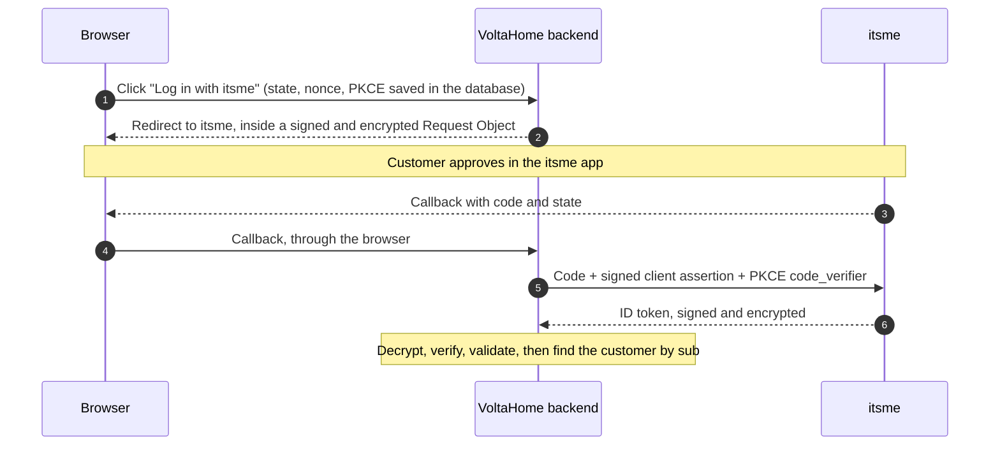
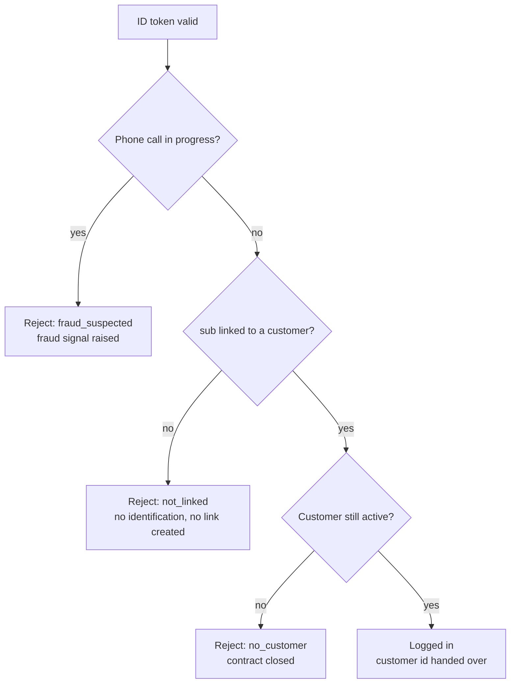

# Walkthrough: the four Spring Security defaults that do not fit itsme

Key pairs in both directions, a pseudonymous user id, no HTTP session and a locked-down network: a step-by-step walkthrough of this sample. The [README](../README.md) is the reference; this page explains the reasoning, in reading order.

A customer taps **Approve** in the itsme app. Two seconds later, their energy supplier's portal shows their dashboard. In those two seconds, six things happen between the browser, the Spring Boot backend and itsme.

If you have already added "Log in with Google" to a Spring application, you know the comfortable part: a few lines of configuration, and `oauth2Login()` does the rest. With itsme, that comfort ends quickly. Four of Spring Security's defaults do not fit, and each one fails in its own way.

This page walks through those four defaults. For each one: what Spring does by default, why it breaks with itsme, how the sample fixes it, and which test proves the fix.

The example is a fictitious energy supplier, **VoltaHome**. The stack is Spring Boot 4.0, Spring Security 7 and Java 17.

## Contents

- [Run it first](#run-it-first)
- [The map: one login in six hops](#the-map-one-login-in-six-hops)
- [Why oauth2Login() is not enough](#why-oauth2login-is-not-enough)
- [Default 1: everything is signed and encrypted](#default-1-everything-is-signed-and-encrypted)
- [Default 2: the user is a pseudonym](#default-2-the-user-is-a-pseudonym)
- [Default 3: there is no session](#default-3-there-is-no-session)
- [Default 4: the network is locked](#default-4-the-network-is-locked)
- [Bonus: what the browser can change](#bonus-what-the-browser-can-change)
- [Proving it without itsme](#proving-it-without-itsme)
- [Before production](#before-production)
- [The four defaults, in four lines](#the-four-defaults-in-four-lines)

## Run it first

Before reading any code, see the login work. It takes five minutes; the README's [Quick start in IntelliJ](../README.md#quick-start-in-intellij) has the details.

1. Open the project in IntelliJ (the free Community edition is enough): *File → Open*, select `pom.xml`, then *Open as Project*.
2. In the run configurations at the top right, pick **VoltaHome (local, itsme stub)** and click *Run*.
3. Open `http://localhost:8080` and click **Log in with itsme**.

You land on a page called **itsme stub**. The application serves it itself, only when the `local` profile is active. It stands in for the approval in the itsme app, and it shows exactly what the application asked itsme for.

Choose **Alex Martin — itsme linked to VoltaHome**. The browser returns to VoltaHome and shows the result of the login as JSON, with `"customerId": "C-1001"`.

Now log in again and choose **Sam Peeters — VoltaHome customer, itsme not linked**. Sam is a customer, but VoltaHome has never seen this itsme account, so the login is refused: "This itsme account is not linked to a VoltaHome account." Then choose **Someone who is not a VoltaHome customer**: same answer. Without identification, the application cannot tell these two people apart, and it does not try. [Default 2](#default-2-the-user-is-a-pseudonym) explains why.

Keep both pages open while you read. Most sections below end with something to try here, or a test to run with the **All tests** run configuration.

## The map: one login in six hops

Here is the whole login on one picture. Come back to it whenever a section below feels abstract.



Three words appear at the start. Each one protects against a different attack, and Spring generates all three:

- **`state`** ties the callback to the login we started. Without it, an attacker could make your browser finish *their* login.
- **`nonce`** ties the ID token to this login. Without it, an old token could be replayed.
- **PKCE** ties the authorization code to our backend. Without it, a stolen code could be exchanged by someone else.

All three must survive between the redirect and the callback. Remember that: it becomes a problem in [default 3](#default-3-there-is-no-session).

## Why oauth2Login() is not enough

With Google, Spring Security needs almost nothing from us. We give it an `issuer-uri`, a client id and a secret. It downloads Google's configuration, sends the user to Google, checks the signature of the ID token, and stores the user in the HTTP session.

Each of those steps assumes something that is not true for this itsme login:

- **Spring assumes a shared secret and a signed ID token.** We use itsme's key-pair method: everything that travels is signed by its sender and encrypted for its receiver.
- **Spring assumes the token tells you who the user is.** itsme gives us a pseudonym, the `sub`. We must already know which of our customers it belongs to.
- **Spring assumes there is an HTTP session.** The backend is stateless, and runs on several instances.
- **Spring assumes it can reach the identity provider whenever it likes.** The network only allows calls that infrastructure teams opened in advance.

None of this requires replacing `oauth2Login()`. Spring Security is built from small, replaceable parts, and we only swap the parts whose assumption is wrong. That is the real lesson: **find the assumption, then replace the smallest part that holds it.**

## Default 1: everything is signed and encrypted

**What Spring does by default.** The backend proves who it is with a client secret. The authorization parameters travel in the browser URL. The ID token is a JWS: signed by the provider, readable by anyone who holds it.

**Why it is not enough for us.** itsme offers a stronger method, based on key pairs, and we use it. Three things travel, and each one is protected the same way: **signed with the sender's private key, encrypted with the receiver's public key.**

| What travels | Signed by | Encrypted for |
|---|---|---|
| **Request Object**: our authorization parameters | us | itsme |
| **Client assertion**: proves to the token endpoint that the request comes from us | us | (not encrypted) |
| **ID token**: tells us who logged in | itsme | us |

**Our keys.** We need two RSA key pairs: one to sign, one to decrypt. We publish the public halves at `/.well-known/jwks.json`, where itsme reads them. The private halves never leave the backend: in production they come from a keystore in a vault. When you run the sample locally, it generates throw-away keys at startup, and refuses to do so if an endpoint is not `localhost`. See the README's [Keys](../README.md#keys).

**The fix.** Three small parts, each in its own place:

1. **Client assertion:** Spring already supports `private_key_jwt`. We give its token client our signing key, and Spring builds and signs the assertion.
2. **Request Object:** we wrap Spring's authorization request resolver. Spring still generates `state`, `nonce` and PKCE; we put everything in a JWT, sign it, encrypt it, and add it as the `request` parameter ([`ItsmeAuthorizationRequestResolver`](../src/main/java/com/example/voltahome/itsme/ItsmeAuthorizationRequestResolver.java), [`ItsmeRequestObjectFactory`](../src/main/java/com/example/voltahome/itsme/ItsmeRequestObjectFactory.java)).
3. **ID token:** Spring's default decoder only verifies signatures. We replace the factory that builds it, in [`ItsmeClientConfig.idTokenDecoderFactory`](../src/main/java/com/example/voltahome/itsme/ItsmeClientConfig.java):

```java
DefaultJWTProcessor<SecurityContext> processor = new DefaultJWTProcessor<>();
processor.setJWEKeySelector(new JWEDecryptionKeySelector<>(      // 1. decrypt with OUR private key
        JWEAlgorithm.RSA_OAEP_256, EncryptionMethod.A128CBC_HS256,
        new ImmutableJWKSet<>(keys.encryptionKeySet())));
processor.setJWSKeySelector(new JWSVerificationKeySelector<>(    // 2. check ITSME's signature
        JWSAlgorithm.RS256, itsmeJwkSource));

NimbusJwtDecoder decoder = new NimbusJwtDecoder(processor);
decoder.setJwtValidator(new DelegatingOAuth2TokenValidator<>(
        new JwtTimestampValidator(Duration.ofSeconds(60)),         // exp
        new OidcIdTokenValidator(registration),                    // iss, aud, iat
        new AcrValidator(properties.acr())));                      // itsme code used?
```

Declaring the decoder factory as a bean is enough: `oauth2Login()` finds it and uses it instead of the default.

**The check that is easy to forget.** Our encryption key is *public*. That is the point of a public key, but it also means anyone can encrypt a token for us. Nimbus would accept an encrypted token that is not signed inside. Only itsme's signature proves where the token comes from, so we refuse any token whose outer envelope does not announce a signed token inside (`cty: JWT`). That is one small method, [`ItsmeCrypto.requireNestedSignedJwt`](../src/main/java/com/example/voltahome/itsme/ItsmeCrypto.java), and one test, `encryptedButUnsignedTokenIsRejected`.

**Check it yourself.** In `ItsmeLoginFlowTest`, two tests play itsme's role: they decrypt our Request Object and verify our client assertion with our public keys. The `IdTokenValidation` group builds tokens that are wrong in exactly one way: missing `acr`, wrong nonce, wrong issuer, another audience, expired, encrypted for another key, signed by a key itsme does not publish, not signed at all. Each one must be rejected.

### If your itsme client uses a client secret

itsme also offers a simpler method: a shared secret instead of key pairs. Some teams choose it because they cannot open an inbound route for their public keys. The sample supports it too: set `itsme.client-authentication=client-secret`, or run **VoltaHome (local, itsme stub, client secret)** in IntelliJ. Four things change:

- **Token request:** `client_id` and `client_secret` in the body instead of a signed assertion. Spring does it without help.
- **No Request Object:** `acr_values` and `claims` travel in the URL, where anyone can edit them.
- **ID token decryption:** `dir` and `A256GCM`, with a key derived from the secret. The itsme pages do not say how; the OpenID Connect specification (§10.2) does: the SHA-256 hash of the secret. Confirm it in the itsme test environment on day one.
- **The nested check matters just as much:** anyone holding the secret can encrypt a token, so only itsme's signature proves the origin.

The trade-off is real. If the secret leaks, an intercepted authorization code can be exchanged and captured ID tokens can be decrypted. With key pairs, there is no shared secret to leak. Choose key pairs when you can. The README compares both in [Two client authentication methods](../README.md#two-client-authentication-methods).

> **Takeaway: sign with your private key, encrypt with theirs. Encryption hides the content; only the signature proves who wrote it.**

## Default 2: the user is a pseudonym

**What Spring does by default.** After validating the ID token, Spring's `OidcUserService` builds the logged-in user, the *principal*, from all the claims in the token. Many tutorials then find the matching account by the `email` claim.

**Why it breaks with itsme.** itsme's email is whatever the person typed into their itsme app. itsme's own claims page says `email_verified` is always `false`, because email verification is not implemented. If we found the customer by that email, anyone could put their victim's address in their own itsme account and log in as the victim. That is not a weak design; it is an account takeover.

So we ask itsme for no personal data at all. We use the `sub`: a stable, opaque id for one itsme account. It tells us *it is the same person as last time*, not *who they are for us*. So the sample authenticates; it does not identify. It logs in only customers whose itsme account is already linked to their VoltaHome account.

**The fix, part 1: look up the customer by `sub`.** We replace the user service with our own, [`ItsmeOidcUserService`](../src/main/java/com/example/voltahome/itsme/ItsmeOidcUserService.java). It never copies itsme's claims into the principal.

```java
Optional<String> customerId = links.findCustomerBySub(sub);

if (Boolean.TRUE.equals(idToken.getClaimAsBoolean(ItsmeClaims.ONGOING_CALL))) {
    fraud.report(FraudSignal.ONGOING_CALL, customerId.orElse(null), sub);
    throw failure("fraud_suspected");
}
if (customerId.isEmpty()) {
    throw failure("not_linked");                 // unknown: no identification, no login
}
if (customers.findActiveById(customerId.get()).isEmpty()) {
    throw failure("no_customer");                // linked, but the contract is closed
}
```

`ongoing_call` deserves a word. itsme can tell us that a phone call was in progress while the user approved. That is the typical pattern of a phone scam where a fake advisor talks the victim through the approval, so we stop there.

**The fix, part 2: refuse an unknown sub.** When the `sub` is not linked, the login stops with `not_linked`. It is tempting to ask the user who they are at that point, with an email address or a customer number. We do not: that is identification, a separate feature with its own risks. The README lists what adding it would take, in [Authentication, not identification](../README.md#authentication-not-identification).

So where do links come from? Not from the login: it only reads them. In the sample they are test data. In a real application, a separate, deliberate step creates them, and the same step must handle one case itsme documents: a customer who re-creates their itsme account gets a new `sub`, and is refused until the link is renewed.



### Where attackers will try

An attacker who cannot link an account will try to make the login identify them anyway. Each attempt has a test:

- **An itsme account nobody linked.** Refused with `not_linked`, and nothing is written to `itsme_link` (`unknownItsmeAccountIsRejected`).
- **The victim's email in the attacker's itsme account.** Still `not_linked`: the email is never read (`unknownItsmeAccountIsNotIdentifiedByTheEmailItsmeSends`).
- **Identity data itsme sends without being asked.** Not handed over: the login result carries our customer id, never a name or an email (`identityClaimsSentByItsmeAreNotHandedOver`).
- **Someone adds an identity claim to the request later.** The tests list the requested claims and scopes exactly: `ongoing_call`, `openid` and the service scope, nothing else (`authorizationRequestAsksForFraudSignalsOnlyNoIdentityClaim`, for both client methods).
- **A closed contract with a linked itsme account.** Refused with `no_customer` (`linkedButInactiveCustomerIsRejected`).

**Check it yourself.** On the itsme stub page, look at the claims the application asked for: only `ongoing_call`. Then choose **Robin Dubois — linked, but contract closed**, and read the error page.

> **Takeaway: never trust an identifier the user can type. Use the provider's pseudonym, and accept only one you already linked.**

## Default 3: there is no session

**What Spring does by default.** A login is two separate HTTP requests: the redirect to itsme, then the callback, sometimes a minute later. Between them, Spring must remember the `state`, the `nonce` and the PKCE `code_verifier` it generated. By default, it keeps them in the `HttpSession`. After the login, it keeps the logged-in user there too.

**Why it breaks with us.** The backend is stateless and runs on several instances, without sticky sessions. The callback can land on an instance that never saw the first request. Spring then finds nothing and fails with `authorization_request_not_found`, the most common error in OIDC integrations behind a load balancer.

**The fix, part 1: replace every part that creates a session.** There are five of them, and missing one is enough to bring the session back. They are all set in [`SecurityConfig`](../src/main/java/com/example/voltahome/security/SecurityConfig.java):

| Spring default | Replaced by |
|---|---|
| `HttpSessionOAuth2AuthorizationRequestRepository` | `JdbcAuthorizationRequestRepository`, our own (below) |
| `HttpSessionOAuth2AuthorizedClientRepository` | `NoOpAuthorizedClientRepository`: we never use the itsme access token after login, so we don't keep it |
| `HttpSessionSecurityContextRepository` | `RequestAttributeSecurityContextRepository` |
| `HttpSessionRequestCache` | `NullRequestCache` |
| `SavedRequestAwareAuthenticationSuccessHandler` | Our own success handler |

**The fix, part 2: keep the login in progress in the database.** We already have a database, so we use it. The table `itsme_authorization_request` holds one row per login in progress, keyed by `state`, valid for five minutes. At callback time, [`JdbcAuthorizationRequestRepository`](../src/main/java/com/example/voltahome/itsme/JdbcAuthorizationRequestRepository.java) reads the row and deletes it:

```java
Optional<OAuth2AuthorizationRequest> found = find(state);        // only rows not yet expired
if (found.isEmpty()) {
    return null;
}
int deleted = jdbc.sql("DELETE FROM itsme_authorization_request WHERE state = :state")
        .param("state", state)
        .update();
return deleted == 1 ? found.get() : null;    // 0 = another callback already used it
```

Why check the number of deleted rows? Because two callbacks with the same `state` can arrive at the same moment, for example after a double click or a replay attempt. Both can read the row, but only one can delete it. The one that deletes nothing gets `null`, and Spring rejects it. This gives single use without any database-specific SQL. A scheduled job removes the rows of logins that were never completed.

**The fix, part 3: hand over and step back.** Once the customer is found, the itsme part is done. The success handler passes an `ItsmeLoginResult` (customer id, authentication method, level and time) to a `LoginHandover` interface. Issuing the application's own token is the job of the code behind that interface. One constraint is worth telling that team: the callback is a full browser navigation, not an AJAX call, so the response must be a page or a redirect, never a JSON body read by JavaScript. And the token must never travel in a URL.

**Check it yourself.** Three tests prove the behaviour: `noSessionIsCreatedDuringTheWholeFlow` (no `JSESSIONID` cookie, ever), `concurrentCallbacksWithTheSameStateSucceedOnlyOnce` (two threads, one winner) and `loginInProgressExpiresAfterFiveMinutesAndIsPurged` (a test clock moves time forward, so the test doesn't wait five minutes).

> **Takeaway: "stateless" is not a setting, it is five replaced components. Prove it with a test that looks for the session cookie.**

## Default 4: the network is locked

**What Spring does by default.** With `issuer-uri`, Spring Boot downloads the provider's discovery document at startup and takes every endpoint from it. It is elegant: the provider can move an endpoint, and your application follows.

**Why it breaks with us.** In many companies, a backend cannot call the internet freely. Outgoing calls go through a proxy, and each destination is opened by an infrastructure team, on request, in advance. In that world, "the application follows" is a problem: an endpoint that moves is an endpoint the firewall blocks. And with `issuer-uri`, an unreachable itsme means an application that does not even start.

**The fix, part 1: static endpoints.** We declare the itsme endpoints in configuration, per environment, and build the `ClientRegistration` ourselves. All backend calls go to a single host per environment, `idp.e2e.itsme.services` or `idp.prd.itsme.services`, so the request to the infrastructure team fits in one line.

One flow goes the other way, and it is easy to forget in the request to the infrastructure team: **itsme calls us** to download our public keys at `/.well-known/jwks.json`. That URL must be public, served with an OV or EV certificate (itsme refuses domain-validated certificates such as Let's Encrypt), and must answer in under a second.

**The fix, part 2: an explicit proxy.** Two clients leave the backend: Spring's `RestClient` for the token endpoint, and Nimbus's retriever for itsme's public keys. By default, both use the JVM-wide proxy settings. We give each of them the proxy explicitly instead. The route to itsme is then visible in the itsme configuration, it does not depend on settings shared with the rest of the JVM, and it can be changed without touching anything else.

**The fix, part 3: discovery as an alarm, not as a source.** We still read the discovery document, but only to compare it with our configuration: at startup and every morning ([`ItsmeDiscoveryCheck`](../src/main/java/com/example/voltahome/itsme/ItsmeDiscoveryCheck.java)). The result is `OK`, `MISMATCH` or `UNREACHABLE`. A mismatch is logged as an error, for alerting. It never blocks startup. If itsme moves an endpoint one day, we hear it from our monitoring, not from our customers.

One more reason to read the discovery document at least once: the itsme examples show the issuer with two different host names. Copy the value from the real document of each environment, never from a documentation example.

**Check it yourself.** The discovery tests cover the three outcomes, including an endpoint that moved.

> **Takeaway: in a locked network, configuration is the source of truth and discovery is the smoke detector.**

## Bonus: what the browser can change

The authorization request tells itsme two important things: which claims we want, and that we want `acr_advanced`, meaning the user must type their itsme code. A fingerprint alone is not enough.

The authorization request travels through the browser's address bar, and anyone can edit an address bar. Without protection, removing `acr_values` from the URL would quietly lower the security level. That is why, with key pairs, these parameters travel only inside the Request Object: signed by us, so itsme notices any change; encrypted for itsme, so nobody can even read them on the way.

**Try it.** On the itsme stub page, add `&acr_values=x` to the address and reload. The stub tells you it ignores it: only the Request Object counts, as the OpenID Connect specification defines.

**With a client secret, try the opposite.** Run the client secret configuration: there is no Request Object, so the parameters sit in the URL. Remove `acr_values` from the address, reload, and log in as Alex. itsme falls back to the basic level, and the login is refused. This time the `acr` check on the ID token is the only lock, and you just watched it hold.

We still check the `acr` value *inside the ID token*. Two locks are better than one: if a configuration change ever stopped sending the Request Object, [`AcrValidator`](../src/main/java/com/example/voltahome/itsme/AcrValidator.java) would still refuse a login without the itsme code. The general rule: **anything that passes through the browser can be changed, so protect the request and check the response.**

One honest caveat. The itsme v2 documentation describes `acr_values` in the request, but it does not show the `acr` claim in the ID token. Confirm it in the itsme test environment early. If itsme does not send it, this check rejects every login, and you will want to know that on day one, not in production.

## Proving it without itsme

You cannot call itsme from a unit test, and most developers in a team will never hold the test credentials. So the sample uses two stand-ins, each for a different job. Both have their own key pairs and do the cryptography of the itsme side with the same class, `ItsmeStubCrypto`.

**For automated tests: WireMock.** WireMock runs inside the test JVM and answers on itsme's back-channel URLs: the discovery document, itsme's public keys and the token endpoint. The token endpoint only answers a request that carries a client assertion and a PKCE `code_verifier`. Two tests then play itsme's role in full: they decrypt the Request Object we sent and verify our client assertion, with our public keys.

**For your browser: the itsme stub.** With the `local` profile, the application serves an itsme stand-in under `/itsme-stub`. It reads our public keys from `/.well-known/jwks.json`, like itsme would. It decrypts and verifies the Request Object, checks the redirect URI, PKCE, a single-use code valid for three minutes and the signed client assertion, and returns ID tokens encrypted for us. A guard stops the application if this profile is ever started with an endpoint that is not `localhost`.

### The tests are a list of attacks

The most useful way to read the tests is as a list of things an attacker, or a bug, could try, with the expected answer:

| Attempt | Expected answer |
|---|---|
| A forged `state`, or the same callback replayed | `authorization_request_not_found` |
| Two callbacks at the same moment | Only one succeeds |
| A token encrypted for another key, or signed by a key itsme does not publish | `invalid_id_token` |
| A token encrypted for us but not signed | `invalid_id_token` |
| A token for another client, from another issuer, or expired | `invalid_id_token` |
| An old nonce | `invalid_nonce` |
| A fingerprint-only approval | `invalid_id_token` |
| A phone call during approval | `fraud_suspected` |
| An itsme account that is not linked, even one carrying a victim's email | `not_linked` |

Each test changes exactly one thing in an otherwise valid flow. That is what makes a failing test easy to read.

```java
@Test
void basicAcrIsRejected() throws Exception {
    login(t -> t.acr(ItsmeWireMock.ACR_BASIC))
            .andExpect(redirectedUrl("/login-error?error=invalid_id_token"));
}
```

**Exercise.** Add a test where the ID token has *two* audiences: our client id and another one. Which error do you expect? Write the test first, then run it. If the result surprises you, read `OidcIdTokenValidator` in Spring Security, and look for `azp`: it is short and worth the time.

One limit to keep in mind: these stand-ins reproduce *our reading* of the itsme documentation. They prove the code is consistent with that reading. Only the itsme test environment can prove the reading itself.

## Before production

The sample is a reference, not a finished product. Before real customers use it, go through this list. The README's [Rules you must not change](../README.md#rules-you-must-not-change) still apply to every item.

**Confirm in the itsme test environment.** The README keeps the full list in [Points to confirm in itsme E2E](../README.md#points-to-confirm-in-itsme-e2e):

- The ID token contains the `acr` claim. The itsme documentation does not promise it.
- The ID token format: encrypted with `RSA-OAEP-256` and `A128CBC-HS256`, signed with `RS256`. With a client secret: `dir` and `A256GCM`, with the key derived from the secret as the OpenID Connect specification describes. itsme lets you choose an RS256 or HS256 signature for this method: choose RS256, the only one the sample accepts.
- itsme accepts the Request Object as the sample builds it.
- The exact `issuer` and `jwks_uri` values in each environment's discovery document.

**Ask itsme during onboarding.** Give them the URL of your public keys and your redirect URI. Ask them to make PKCE mandatory for your client: the code sends it anyway, but enforcement on the itsme side refuses a request without PKCE, even if someone changes the code later.

**Look after the keys.** Generate the two key pairs once, keep the private keys in a vault, and never in Git or a log. Plan the rotation before you need it: itsme caches your public keys for up to 24 hours, so a new encryption key must be published, and the old one kept able to decrypt, for at least that long.

**Decide how links are created.** The login only reads them. Linking an itsme account to a customer, the first time or after the customer re-created their itsme account, is a separate step with its own checks. If you add identification for it, the README lists what changes.

**Keep tokens out of every log.** Log your own customer id and, if needed, the itsme `sub`, never token content. Keep Spring Security logging at `INFO` in production: at `DEBUG`, principals and tokens can be printed.

**Wire the alarms.** Send the `ERROR` from the discovery check and the fraud signals to the systems people actually watch.

**Write the error messages.** The login error page receives a code such as `fraud_suspected`. Map each code to a message written by your team, and never display the raw parameter: it comes from the URL, so anyone can change it. The codes are listed in the README's [Error codes](../README.md#error-codes).

## The four defaults, in four lines

1. **Everything is signed and encrypted:** sign with your private key, encrypt with theirs; replace the decoder factory, and check that the ID token is signed inside.
2. **The user is a pseudonym:** look up the `sub`, never a typed email; accept only a `sub` you already linked.
3. **There is no session:** replace five components, keep logins in progress in your database, and prove it with a test.
4. **The network is locked:** configure endpoints and proxy explicitly, open the inbound route to your public keys, and use discovery as an alarm.

Notice what we did *not* do: we never fought Spring Security or rewrote the OIDC flow. Each time, we found the assumption that did not hold, and replaced the smallest part that held it. That habit will serve you with any identity provider, not only itsme.

---

All names and email addresses in this page and in the sample are fictitious; the addresses use example.com, a domain reserved for documentation. The sample requests no identity data from itsme. itsme® is a registered trademark of Belgian Mobile ID. This sample is not affiliated with or endorsed by Belgian Mobile ID.
